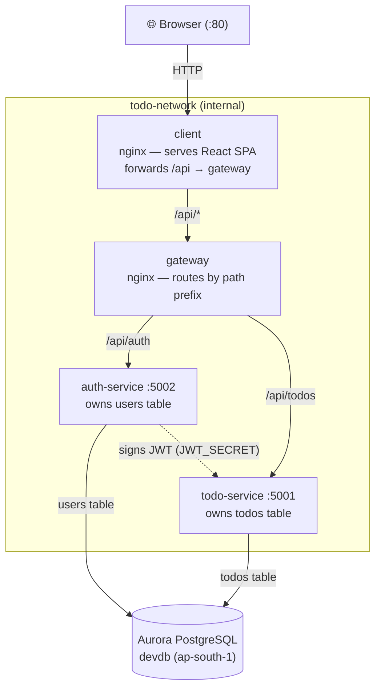
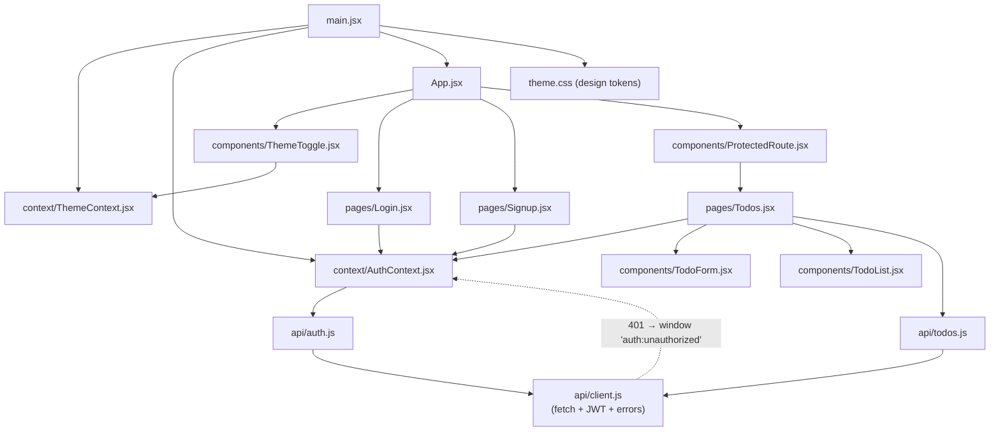
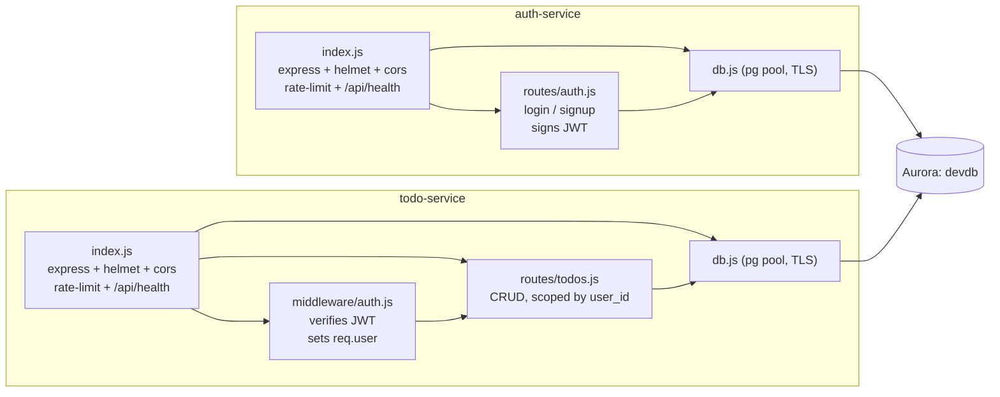
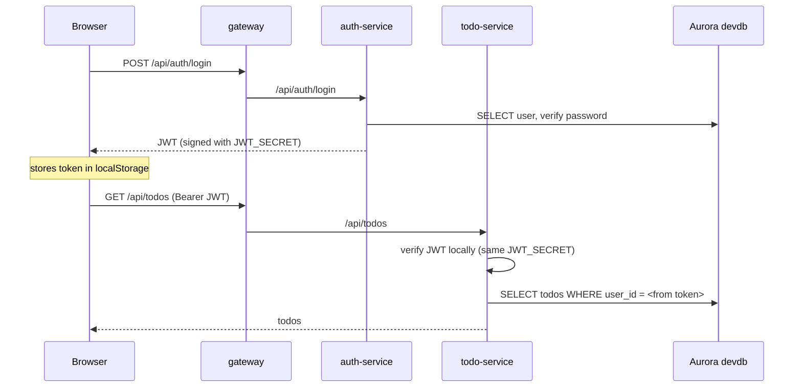

# Code Graph

A visual map of how this codebase is wired together — module imports, the
request flow through the containers, and the trust relationship between
services. Render these in VS Code (Markdown Preview Mermaid Support) or on
GitHub, both of which draw Mermaid natively.

> Generated from the actual imports/routes in the repo. If you move or rename
> files, update the affected diagram.

---

## 1. Runtime request flow (containers)

Who talks to whom at runtime. The browser only ever reaches the client; the
gateway is the single entry point to the backend, which it routes by path
prefix. Both services share one Aurora database but each owns one table.

The dashed line is **not** a network call — todo-service never calls
auth-service. It only shares the same `JWT_SECRET`, so it can verify tokens
auth-service signed. That's what keeps logged-in users working even if
auth-service is down.

---

## 2. Frontend module graph (`client/src`)

How the React app is imported together. All network traffic funnels through
`api/client.js`, and the two React contexts (auth + theme) wrap the app.

Key edges:
- **`api/client.js` is the single network chokepoint** — token injection, JSON
  parsing, and error handling live only here.
- A **401** from any request dispatches a `window` event that `AuthContext`
  listens for → clears the session → `ProtectedRoute` redirects to `/login`.
- **`theme.css`** is the design-token source of truth; every component styles
  itself from its `var(--*)` tokens, and `ThemeContext` flips `data-theme` on
  `<html>` to switch light/dark.

---

## 3. Backend service internals

Both services follow the same self-contained shape: `index.js` wires
middleware + routes, `routes/*` run queries through `db.js`, and `db.js` owns
the single shared `pg` pool. They share **no code**.

- Every `/api/todos/*` request passes through **`middleware/auth.js` first**,
  which verifies the JWT and puts `req.user` on the request. Routes then scope
  every query by `user_id = req.user.id` — that's the only thing isolating one
  user's todos from another's.
- Tables are created on boot via `CREATE TABLE IF NOT EXISTS` in each
  `start()` — there are no migration files.
- `todos.user_id` is a plain `INTEGER` with **no** `REFERENCES users(id)` — the
  services deliberately don't couple across table ownership.

---

## 4. The auth trust link (why there's no service-to-service call)

todo-service **never** contacts auth-service — it trusts the token's signature.
Shared secret, not a network dependency. This is the central architectural
decision of the project.
